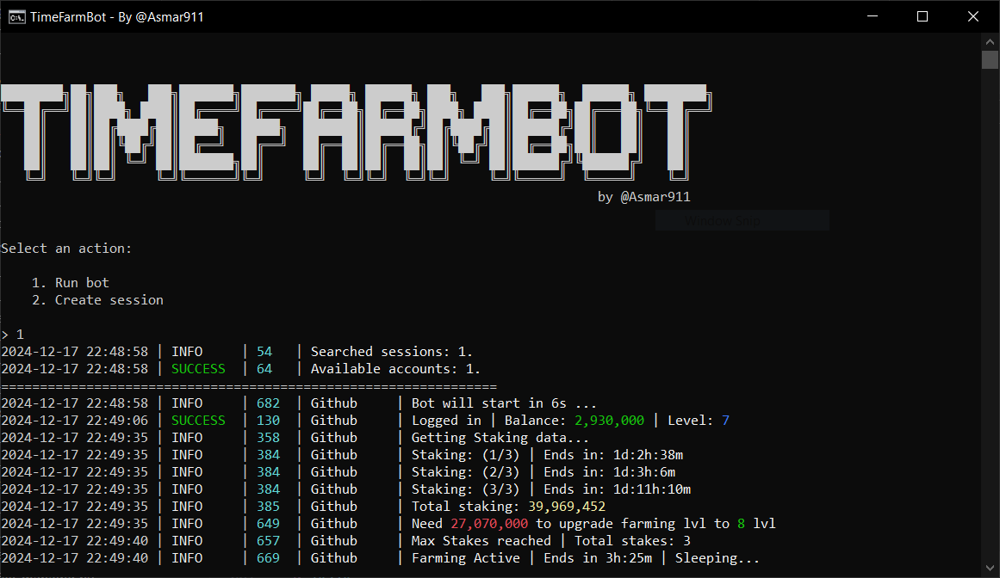

<h1 align="center">
  TimeFarmBot
</h1>
<p align="center">
    Auto Farming For TimeFarm Bot
</p>

<p align="center">
    <a href="https://t.me/Asmar911">
    </a>
    <a href="https://t.me/TELETAPBOTS">
    </a>
    <a href="https://t.me/TELETAPBOTSCHAT">
    </a>
    <a href="https://t.me/TimeFarmCryptoBot?start=1eYFkqTqjduuyi4DN">
    </a>
</p>



<!-- ---
>[!Info]
>**This repo contains the free version of this software.**
>**Connected bots:** <a href="">Blum</a>, <a href="">Goats</a>, <a href="">Major</a>, <a href="">Notpixel</a>
>For the full version contact me <a href="https://t.me/Asmar911"> **@asmar911**</a> -->


## **Features**
- ✅ **Multithreading**
- ✅ **Accounts System**
- - ✅ **Proxy binding to session** (Account)
- - ✅ **User-Agent binding to session** (Account)
- ✅ **Support for tdata / pyrogram .session**
- ✅ **Registration in bots**
- ✅ **Auto-Referral**
- ✅ **Daily rewards**
- ✅ **Auto-tasks**
- ✅ **Auto-Farm**
- ✅ **Auto-Stake**
- ✅ **Auto-Upgrade-Farming**
- ✅ **Auto-tasks**
- ✅ **Easy to use**
---


## Quick Start 📚

To fast install libraries and run bot - open run.bat on Windows or run.sh on Linux

## Prerequisites
Before you begin, make sure you have the following installed:
- [Python](https://www.python.org/downloads/) **version 3.10**

## Obtaining API Keys
1. Go to my.telegram.org and log in using your phone number.
2. Select "API development tools" and fill out the form to register a new application.
3. Record the API_ID and API_HASH provided after registering your application in the .env file.

## Installation
You can download the [**repository**](https://github.com/Asmar911/TimeFarmBot) by cloning it to your system and installing the necessary dependencies:
```shell
git clone https://github.com/Desamod/TimeFarmBot
cd TimeFarmBot
```

Then you can do automatic installation by typing:

Windows:
```shell
run.bat
```

Linux:
```shell
run.sh
```

# Linux manual installation
```shell
python3 -m venv venv
source venv/bin/activate
pip3 install -r requirements.txt
cp .env-example .env
nano .env  # Here you must specify your API_ID and API_HASH, the rest is taken by default
python3 main.py
```

You can also use arguments for quick start, for example:
```shell
~/TimeFarmBot >>> python3 main.py --action (1/2)
# Or
~/TimeFarmBot >>> python3 main.py -a (1/2)

# 1 - Run Bot
# 2 - Create Session
```

# Windows manual installation
```shell
python -m venv venv
venv\Scripts\activate
pip install -r requirements.txt
copy .env-example .env
# Here you must specify your API_ID and API_HASH, the rest is taken by default
python main.py
```

You can also use arguments for quick start, for example:
```shell
~/TimeFarmBot >>> python main.py --action (1/2)
# Or
~/TimeFarmBot >>> python main.py -a (1/2)

# 1 - Run Bot
# 2 - Create Session
```

### Usages
When you first launch the bot, create a session for it using the 'Create Session' command. It will create a 'sessions' folder in which all accounts will be stored, as well as a file accounts.json with configurations.
If you already have sessions, simply place them in a folder 'sessions' and run the clicker. During the startup process you will be able to configure the use of a proxy for each session.
User-Agent is created automatically for each account.

Here is an example of what accounts.json should look like:
```shell
[
  {
    "session_name": "name_example",
    "user_agent": "Mozilla/5.0 (Linux; Android 14) AppleWebKit/537.36 (KHTML, like Gecko) Chrome/125.0.6422.165 Mobile Safari/537.36",
    "proxy": "type://user:pass:ip:port"  # "proxy": "" - if you dont use proxy
  }
]
```


<h3 align="center">
Contacts
</h3>

---

<p align="center">
    For support or questions, you can contact me
</p>
<p align="center">
    <a href="https://t.me/TELETAPBOTS">
    </a>
    <a href="https://t.me/TELETAPBOTSCHAT">
    </a>
</p>
